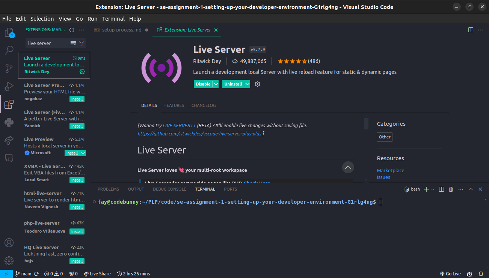

# Developer Environment Setup on Ubuntu 22.04

## 1. Install Visual Studio Code

1. Open terminal
2. Run the following commands:
    ```sh
    sudo apt update
    sudo apt install software-properties-common apt-transport-https wget
    wget -q https://packages.microsoft.com/keys/microsoft.asc -O- | sudo apt-key add -
    sudo add-apt-repository "deb [arch=amd64] https://packages.microsoft.com/repos/vscode stable main"
    sudo apt update
    sudo apt install code
    ```
3. Open Visual Studio Code:
    

## 2. Install Git

1. Open terminal
2. Run the following command to install Git:
    ```sh
    sudo apt install git
    ```
3. Configure Git with your name and email:
    ```sh
    git config --global user.name "Your Name"
    git config --global user.email "youremail@example.com"
    ```
4. Verify Git installation by running:
    ```sh
    git --version
    ```
5. The terminal output  showed the installed Git version, similar to this:
    

## 3. Initialize GitHub Repository

1. Create a directory:
    ```sh
    mkdir Dashboard
    cd Dashboard
    git init
    echo "# Dashboard" > README.md
    git add README.md
    git commit -m "Initial commit"
    ```
2. My project structure  looked like this:
    

## 4. Install Python

1. Open terminal
2. Run:
    ```sh
    sudo apt install python3 python3-pip
    ```
3. Verify installation:
    ```sh
    python3 --version
    pip3 --version
    ```
4. Python version output:
    

## 5. Install MySQL

1. Open terminal
2. Run:
    ```sh
    sudo apt update
    sudo apt install mysql-server
    sudo mysql_secure_installation
    ```
3. Configure MySQL:
    

## 6. Install Docker (Optional)

1. Open terminal
2. Run:
    ```sh
    sudo apt install docker.io
    sudo systemctl start docker
    sudo systemctl enable docker
    sudo usermod -aG docker ${USER}
    ```
3. Docker Desktop
    


## 7. Install VS Code Extensions

1. Open VS Code
2. Go to Extensions view (`Ctrl+Shift+X`)
3. Install:
    - Python
    - Django
    -Live Server
4. Extensions view:
    
    
    

## Challenges Faced

- Configuring MySQL initially failed due to conflicting software versions, resolved by reconfiguring the installation.
- Ensuring Docker group permissions required a system restart to take effect properly.
